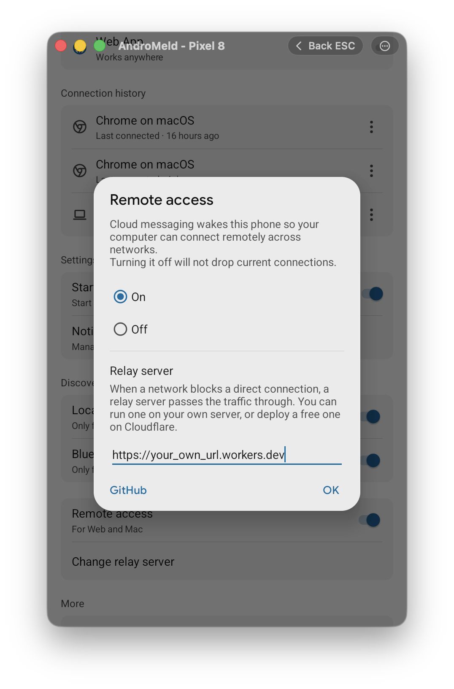

# webrtc_turn

[English](README.md) · [中文](README.zh-CN.md)

[AndroMeld](https://andromeld.catchingnow.com/) 的自建 WebRTC 中转（TURN）服务器。

AndroMeld 在设备（手机、Mac、浏览器）之间会优先建立 P2P 直连。但在部分受限网络（如移动蜂窝网络、公司或校园大局域网、对称型 NAT）下，设备之间无法直接握手，此时就需要一台公网中转服务器（TURN Relay）来转发流量。

- **端到端加密**：中转服务器仅转发加密数据包，无法解密或窥探你的任何数据。
- **自动降级**：能直连时绝不走中转，仅在直连失败时自动无缝降级走中转。

---

## 方案对比

| | Cloudflare Workers（推荐） | Docker 自建 |
|---|---|---|
| **需要准备** | Cloudflare 账号 * | 带公网 IP 的 Linux 服务器 + 域名 |
| **运行节点** | Cloudflare 全球边缘网络 | 你的 VPS 所在机房 |
| **费用** | 每月前 1,000 GB 免费 | 仅 VPS 本身费用 |

\* Cloudflare 需要开通支付方式，每个月前 1,000 G 流量免费，超出后 $0.05/GB

---

## 方案一：部署到 Cloudflare（推荐）

### 1. 创建 TURN Key
1. 打开 Cloudflare 控制台的 [Realtime > TURN Keys](https://dash.cloudflare.com/?to=/:account/realtime/turn)。
2. 点击 **Create**（名称随意）。
3. 页面会生成 **Key ID** 和 **API Token**。**请立即复制并保存好**（API Token 仅展示一次，关闭后无法再次查看）。

### 2. 部署 Worker
点击下方按钮一键部署到 Cloudflare（会请求 GitHub 授权以自动 fork 并构建本项目）：

[](https://deploy.workers.cloudflare.com/?url=https://github.com/heruoxin/webrtc_turn/tree/main/cloudflare)

按页面提示填入步骤 1 中保存的 **Key ID** 和 **API Token**，点击部署即可。

<details>
<summary><b>命令行部署（可选）</b></summary>

如果你更习惯用终端，也可以在本地直接部署：
```bash
git clone https://github.com/heruoxin/webrtc_turn
cd webrtc_turn/cloudflare
npm install
npm run setup
```
</details>


### 3. 获取中转 URL
部署完成后，把控制台分配的 `*.workers.dev` 域名粘贴到 AndroMeld Android 客户端 **远程访问 > 中转服务器** 中。
- 为保证安全，该部署页仅在部署后的 **30 分钟内**可访问（超时后返回 404）。如需再次打开，在控制台中重新触发一次部署即可。 

 中转服务器" width="360">

---

## 方案二：使用 Docker 部署

适合拥有公网 Linux 服务器的用户。由于 coturn 依赖 `network_mode: host`，**不支持** macOS / Windows 上的 Docker Desktop。

### 1. 解析域名
添加一条 DNS A 记录（如 `turn.example.com`）指向服务器的公网 IP。内置的 Caddy 会在首次访问时自动申请并续期 SSL 证书。

> **注意**：AndroMeld 各端只支持 `https://` 协议。

### 2. 放行防火墙端口
确保服务器防火墙及云厂商安全组放行以下端口：

| 端口 | 协议 | 用途 |
|---|---|---|
| `80`、`443` | TCP | 凭据分发接口与 SSL 证书申请 |
| `3478` | TCP / UDP | TURN 中转控制连接 |
| `49160-49200` | UDP | TURN 媒体与数据转发端口段 |

### 3. 配置与启动
```bash
cd docker
cp .env.example .env
```
打开 `.env` 填写配置（文件注释中自带生成随机密钥的命令）：
- `PUBLIC_HOST`：你的域名（如 `turn.example.com`）
- `ACCESS_TOKEN`：自定义一个访问口令
- `TURN_STATIC_SECRET`：coturn 鉴权密钥

启动服务：
```bash
docker compose up -d
```

### 4. 获取中转 URL
部署完成后，你的中转 URL 为：
```text
https://turn.example.com/?token=你的ACCESS_TOKEN
```

<details>
<summary><b>进阶：开启 TURN over TLS (5349 端口)</b></summary>

少数严格的网络环境会封禁 3478 端口。开启 TLS 封装（5349 端口）可以提高穿透成功率：
1. 为 coturn 准备域名的证书和私钥文件；
2. 在 `docker-compose.yml` 中移除 `--no-tls`，添加 `--tls-listening-port=5349`、`--cert` 和 `--pkey`；
3. 将 `turns:${PUBLIC_HOST}:5349?transport=tcp` 追加到 `.env` 的 `TURN_URLS` 中；
4. 证书更新后记得重启 coturn。
</details>

### 5. 在 AndroMeld 中配置
将你的中转 URL 粘贴到 AndroMeld Android 客户端 **远程访问 > 中转服务器** 中即可。

 中转服务器" width="360">

---

## 附录：接口返回格式

客户端向中转 URL 发起 `GET` 请求时，接口会实时签发有效期为 24 小时的临时 ICE 凭据：

```json
{
  "iceServers": [
    {
      "urls": ["turn:turn.example.com:3478?transport=udp"],
      "username": "1787332426:2d81ab8fe31fe13b",
      "credential": "YjHN93xmrXKuN2JnPIl1mcWgBXc="
    }
  ],
  "ttl": 86400
}
```

- Token 错误返回 `401 Unauthorized`。
- 其它未定义路径返回 `404 Not Found`。

---

## 许可证

[GPL-3.0-or-later](LICENSE)
